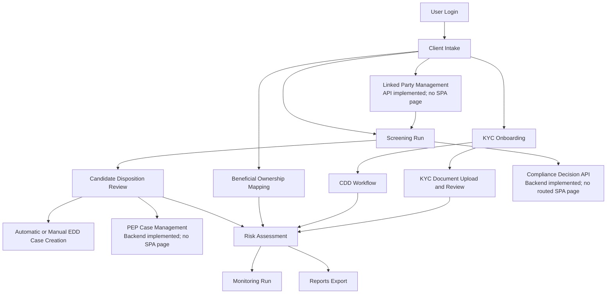
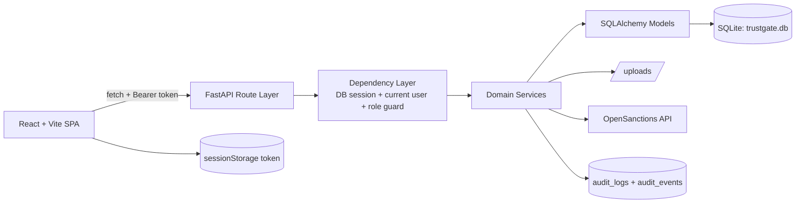
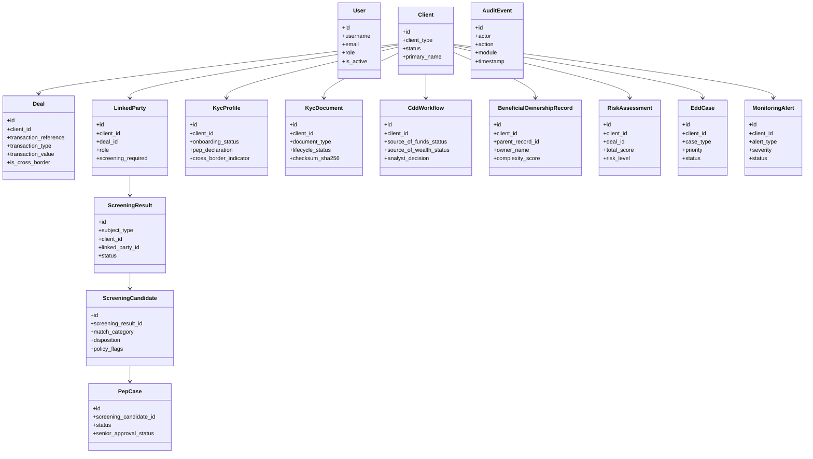
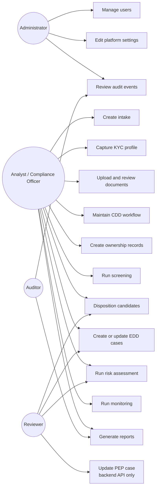
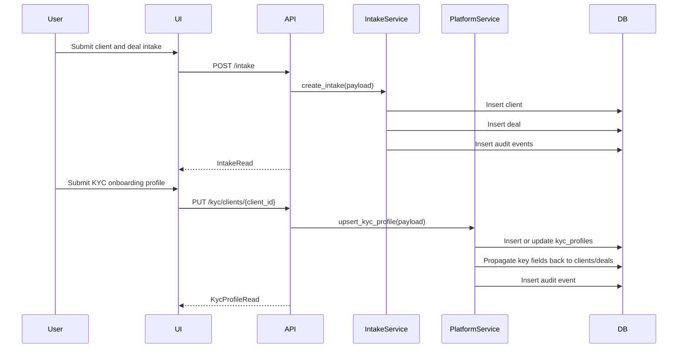
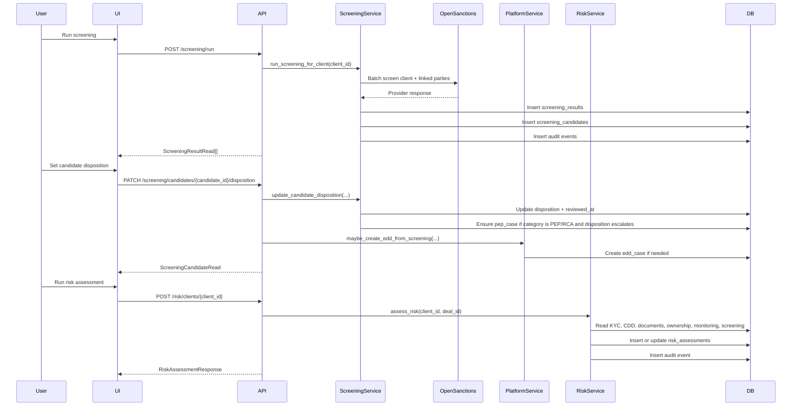
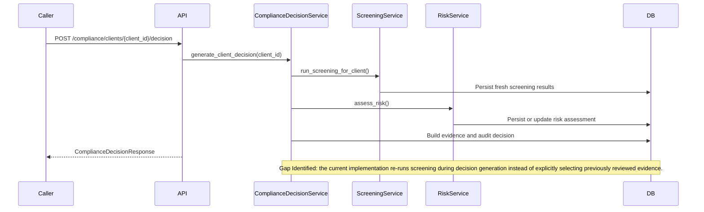

# CHAPTER 1: INTRODUCTION

## 1.1 Summary of Results, Conclusions and Recommendations from Research

The research document in `docs/research.docx` establishes the real-estate sector in Zimbabwe as a materially exposed anti-money-laundering domain, with particular concern around manual compliance processes, weak beneficial ownership transparency, incomplete source-of-funds verification, and underdeveloped Politically Exposed Person (PEP) controls. The study reports that Anti-Money Laundering (AML) frameworks are only moderately effective in practice, not because regulatory structures are absent, but because implementation remains operationally weak.

The most significant research conclusion is that Customer Due Diligence (CDD) is the strongest predictor of AML effectiveness. The study further concludes that Know Your Customer (KYC) procedures are only moderately implemented and that PEP screening remains the weakest compliance component. Operational constraints identified by the research include lack of technological compliance systems, limited staff training, weak enforcement, and difficulty verifying the source of funds. These findings align directly with the problem space addressed by the implemented TrustGate prototype.

The implemented prototype can be understood as a technical response to those research conclusions. Rather than modelling AML compliance as a single verification step, the system operationalises the process as a chain of interrelated modules: client intake, KYC onboarding, document collection, CDD workflow, beneficial ownership mapping, linked-party screening, risk scoring, EDD case management, monitoring, reporting, and audit logging. In this sense, the prototype does not merely store customer records; it formalises the control sequence that the research identified as weak when handled manually.

Table 1.1 maps the principal research findings to the implemented system.

| Research finding from `research.docx` | Prototype response in TrustGate | Current implementation status |
|---|---|---|
| Manual KYC reduces reliability and consistency | Structured KYC profile capture with typed fields, status workflow, and audit trail | Implemented |
| CDD has the strongest effect on AML effectiveness | Dedicated `cdd_workflows` entity, checklist JSON, analyst/reviewer decisions, and review notes | Implemented |
| PEP screening is weak and underdeveloped | OpenSanctions-backed screening, candidate categorisation, PEP/RCA case model | Implemented in backend; partial in UI |
| Source-of-funds verification is difficult | CDD source-of-funds and source-of-wealth review statuses plus document support | Implemented |
| Beneficial ownership opacity increases risk | Linked-party model and beneficial ownership hierarchy records | Implemented; linked-party UI gap exists |
| Weak enforcement and monitoring reduce compliance effectiveness | Audit events, monitoring alerts, workbench queue, and report exports | Implemented at prototype level |
| Digital compliance systems are needed | React/FastAPI web platform with local persistence and external screening integration | Implemented |

The research recommends seven major improvements: stronger CDD procedures, digital KYC adoption, centralised PEP screening, training, stronger enforcement, broader monitoring technology, and better stakeholder collaboration. The prototype implements some of these recommendations directly, particularly digital KYC, formalised CDD, automated screening integration, explainable risk scoring, and audit-ready reporting structures. Other recommendations remain only partially realised. A centralised national PEP repository is not part of the codebase; instead, the prototype integrates a third-party provider abstraction. Capacity-building and regulator collaboration are also outside the current software boundary.

The research therefore supplies the normative and empirical basis for the prototype, while the prototype translates those concerns into executable controls. The implemented system is best interpreted as a technical artefact that attempts to reduce the implementation gap identified in the study.

## 1.2 Statement of the Problem

The problem addressed by the prototype is the operational weakness of AML compliance in real-estate transactions when onboarding, due diligence, screening, ownership analysis, and risk judgement are fragmented across manual or disconnected processes.

In the research document, the problem is stated as the continued exposure of Zimbabwe's real-estate sector to money laundering despite the existence of AML regulations. Estate agents' reliance on manual KYC forms, the absence of digital and centralised verification systems, and weak PEP identification mechanisms undermine practical compliance effectiveness. The prototype translates that research problem into the following technical problem statement:

A compliance team requires a system that can capture client and deal data, structure KYC and CDD evidence, map related parties and ownership structures, execute screening through an external provider, persist candidate-level review outcomes, quantify risk deterministically, generate alerts, and preserve an auditable record of decisions across the workflow.

Within the implemented codebase, the problem is not treated as a general workflow issue. It is modelled specifically for compliance in transaction-heavy, relationship-rich real-estate contexts. This is visible in persisted fields such as transaction value, property location, source-of-funds summary, beneficial ownership complexity score, screening dispositions, and risk overrides.

The operational deficiencies addressed by the prototype are therefore the following:

- Disconnected capture of customer and transaction context.
- Inconsistent linked-party and ownership recording.
- Weak traceability between screening results and analyst decisions.
- Limited reproducibility of risk judgements.
- Poor continuity between evidence collection, escalation, and audit review.

## 1.3 System Objectives

The prototype objectives are derived from the research findings but are stated here in terms of actual implemented system behaviour.

| Objective | Technical meaning in the prototype | Status |
|---|---|---|
| Digitise client intake | Create a typed client record and a linked deal record in one transaction | Implemented |
| Digitise KYC onboarding | Capture identity, residency, occupation, company, tax, PEP, and related-party declarations | Implemented |
| Support documentary evidence management | Upload files, compute SHA-256 checksums, track lifecycle status, and summarise missing evidence | Implemented |
| Formalise CDD review | Store structured review outcomes for source of funds, source of wealth, payment method, and transaction purpose | Implemented |
| Capture relationship and ownership complexity | Persist linked parties and beneficial ownership structures, including hierarchy and complexity score | Implemented; linked-party UI is incomplete |
| Execute external screening | Batch-screen client and eligible linked parties via OpenSanctions adapter | Implemented |
| Persist analyst screening review | Record candidate disposition, review timestamp, and audit event | Implemented |
| Quantify risk deterministically | Calculate risk from screening, ownership, documents, CDD, and monitoring factors | Implemented |
| Support EDD escalation | Create EDD cases from manual input and screening-triggered escalation | Implemented |
| Support PEP/RCA follow-up | Persist PEP case workflow and verification statuses | Implemented in backend; not surfaced in SPA |
| Support monitoring and reporting | Generate alerts, monitoring events, workbench items, and report exports | Implemented |
| Preserve auditability | Write audit records for major control actions | Implemented, with some actor-attribution gaps |
| Support configurable governance | Persist administrative settings for risk, checklist, EDD triggers, and monitoring intervals | Partially implemented; not all settings are binding in logic |
| Generate final compliance decision | Produce a decision object with verdict, reasons, evidence, and required actions | Implemented in backend; no routed frontend page |

## 1.4 Chapter Summary

The research establishes that AML compliance in Zimbabwe's real-estate sector is weakened less by lack of regulation than by weak implementation, particularly in CDD, digital KYC, and PEP screening. The TrustGate prototype directly addresses that problem through a modular compliance platform that turns research recommendations into executable workflows. The chapter has shown that the implemented system is aligned to the problem domain, technically grounded in research, and already capable of supporting a substantial portion of the intended compliance lifecycle, while still retaining identifiable prototype limitations.

# CHAPTER 2: PROCESS MODELLING

## 2.1 Introduction

Process modelling in this prototype is not abstract documentation; it is embedded directly in the software architecture. Each major compliance stage is represented by a dedicated API route set, persistence model, and frontend workspace. Consequently, the process model can be inferred from the repository structure, service orchestration, and database tables rather than from design intention alone.

The implemented prototype follows a staged compliance flow in which evidence is progressively enriched and then consumed by downstream controls. Intake precedes KYC, KYC supports document review and CDD, relationship and ownership information enrich screening, screening outcomes influence risk and EDD, and monitoring/reporting operate over persisted operational state.

## 2.2 Process Model

The process model used in this case is the **evolutionary prototype model**.

This classification is justified by the implemented repository for the following reasons:

- The system is already functional end-to-end for several core workflows, but not all modules are equally mature.
- The backend exposes capabilities that are not yet fully surfaced in the frontend, indicating staged growth rather than one-time completion.
- The repository contains raw SQL migrations for newer features such as `pep_cases` and `policy_flags`, showing incremental model evolution.
- Startup logic combines `Base.metadata.create_all()` with a SQLite-safe schema update routine, indicating prototype-oriented evolution rather than rigid migration-only governance.
- Administrative settings are persisted in `app_settings`, suggesting that the design anticipates policy evolution even though not all settings are yet bound into execution logic.
- The local SQLite database already contains live prototype data across multiple modules, confirming iterative use and refinement rather than static mock-up development.

The evolutionary nature of the prototype is especially visible in the screening and risk areas. Screening classification has policy-pack abstractions and explainability metadata; risk scoring uses explicit rule constants and can therefore be recalibrated without redesigning the entire architecture. These are characteristic of a system intended to be refined through repeated operational feedback.

Table 2.1 summarises the justification.

| Indicator in repository | Why it supports evolutionary prototyping |
|---|---|
| Separate backend and frontend modules with uneven coverage | Features can mature independently over time |
| SQL migrations dated after initial model design | Later requirements are being integrated incrementally |
| Newer tables exist but sample data has not exercised all of them | Features are implemented before full operational uptake |
| Hard-coded rules plus persisted settings | Current behaviour is stable enough to run, but designed for future tuning |
| Local sample database with working records | Prototype is being used as a live validation artefact |

## 2.3 Feasibility Study

### 2.3.1 Economic Feasibility

The implemented prototype is economically feasible for pilot and academic demonstration purposes.

| Economic factor | Evidence in implementation | Assessment |
|---|---|---|
| Low software licensing cost | FastAPI, SQLAlchemy, React, Vite, Tailwind CSS, SQLite are open-source | Favourable |
| Low infrastructure overhead | Local SQLite database and filesystem uploads reduce deployment complexity | Favourable for prototype |
| External compliance capability reused | Screening is delegated to OpenSanctions via API adapter rather than built internally | Favourable, but introduces provider dependency |
| Administrative overhead reduction | Dashboard, workbench, reports, and audit logs centralise work previously handled manually | Favourable |
| Future scaling cost | SQLite, local storage, and absence of background workers imply future migration cost | Acceptable prototype trade-off |

The main economic constraint is that the prototype avoids enterprise infrastructure at the expense of production readiness. That trade-off is appropriate for an evolutionary prototype.

### 2.3.2 Technical Feasibility

The prototype is technically feasible and implementable with the chosen stack.

| Technical factor | Evidence | Assessment |
|---|---|---|
| Backend framework suitability | FastAPI route layer with typed schemas and dependency injection | Strong |
| Domain modularity | Separate services for intake, screening, risk, compliance, relationships, and platform operations | Strong |
| Persistence feasibility | SQLAlchemy models mapped to SQLite tables with live local data | Strong for MVP |
| External integration feasibility | OpenSanctions adapter normalises remote payloads into internal models | Strong |
| Frontend feasibility | React SPA already consumes the major operational APIs | Strong |
| Migration discipline | Raw SQL migrations exist, but startup `create_all()` and ad hoc SQLite patching are also used | Adequate for prototype, weak for production |
| Verification maturity | No project-owned automated tests, CI pipeline, or containerisation were found in the repository | Gap Identified |

### 2.3.3 Social Feasibility

Social feasibility concerns whether the system structure is usable by its intended institutional actors.

| Social factor | Prototype support | Observation |
|---|---|---|
| Role differentiation | User roles include administrator, compliance officer, analyst, reviewer, and auditor | Implemented |
| Workflow visibility | Dashboard, workbench, alerts, reports, and audit trail make activity visible | Implemented |
| Cognitive alignment with compliance work | Pages are organised by intake, KYC, CDD, screening, risk, EDD, monitoring, and administration | Implemented |
| Training requirement | The system introduces structured statuses, enumerations, and JSON-backed governance data | Manageable, but training still required |
| Research alignment | Directly addresses digital KYC, CDD, screening, and monitoring weaknesses identified in the research | Strong |

The interface design is operational rather than presentation-oriented, which supports analyst usage but does not eliminate the need for organisational training and process adoption.

### 2.3.4 Operational Feasibility

Operational feasibility is favourable at prototype scale, but constrained at production scale.

| Operational factor | Evidence | Assessment |
|---|---|---|
| Local start-up | Backend auto-creates tables, seeds bootstrap administrator, and prepares upload directory | Strong for prototype |
| Authentication workflow | Login, `/auth/me`, bearer-token use, and role checks are implemented | Operational |
| Core business flow availability | Intake, KYC, documents, CDD, screening, risk, EDD, monitoring, and reporting all have executable endpoints | Operational |
| External dependency | OpenSanctions API key is mandatory in configuration | Operational dependency |
| Monitoring cadence | Monitoring exists only as manual or API-triggered execution | Gap Identified |
| Deployment automation | No Dockerfile, orchestration, or CI/CD workflow was found | Gap Identified |

## 2.4 System Security

The prototype includes meaningful security controls, but they remain prototype-grade rather than production-grade.

### 2.4.1 Implemented controls

| Security control | Implementation evidence | Technical significance |
|---|---|---|
| Password hashing | PBKDF2-HMAC-SHA256 with 240,000 iterations in `auth_service.py` | Stronger than plain hashing; suitable baseline |
| Token-based authentication | Custom HMAC-signed JWT with issuer and expiry claims | Stateless API authentication implemented |
| Route-level access control | `get_current_user()` and `require_roles()` in `app/api/deps.py` | Major modules are role-gated |
| Input validation | Pydantic schemas constrain types, lengths, enums, and required fields | Reduces malformed input risk |
| Audit logging | `audit_logs` and `audit_events` tables capture user actions and metadata | Supports accountability and post-hoc review |
| File integrity metadata | Uploaded documents store SHA-256 checksums and file size | Supports evidentiary integrity |
| CORS allow-list | Configurable allowed origins in `app/core/config.py` | Limits browser-origin access |
| Safe upload filenames | Uploaded filenames are sanitised before persistence | Reduces path-manipulation risk |

### 2.4.2 Security gaps and recommended improvements

| Gap Identified | Observed behaviour | Recommended Improvement |
|---|---|---|
| Default credentials are prototype-convenient | Login page pre-populates `admin` / `admin123!`, and bootstrap admin defaults are defined in config | Remove default credentials from UI and require secure environment-managed bootstrap |
| Custom JWT implementation | Token creation and verification are hand-written rather than delegated to a hardened library | Replace with a mature JWT/security library and add rotation support |
| Actor attribution is inconsistent | Some service paths record only `actor` string and omit `user_id`; compliance decision route omits actor propagation | Standardise audit APIs to require authenticated principal identity |
| Files are stored on local disk | Documents are written unencrypted to `uploads/` and `storage_path` is returned in API responses | Use managed object storage, encryption at rest, and hide filesystem paths from clients |
| Upload validation is limited | No file type allow-list, size ceiling, malware scan, or content inspection was found | Add upload policy enforcement and scanning |
| Monitoring is manual | No scheduler or background worker performs continuous monitoring | Introduce scheduled re-screening and recurring alert evaluation |
| Governance settings are not fully binding | `app_settings` values are persisted but not universally consumed by services | Bind configuration to runtime logic or clearly mark settings as informational |
| No automated verification pipeline | No project-owned tests or CI workflow were found | Add backend and frontend test suites and CI checks |

## 2.5 Chapter Summary

The implemented prototype is best characterised as an evolutionary prototype because it already executes core compliance workflows while still exposing visible areas for iterative refinement. Economic and technical feasibility are strong at prototype scale, and the system is operationally usable for workflow demonstration. Security is not absent; significant controls are present. However, several controls remain incomplete or locally scoped, and the transition from prototype to production would require substantial hardening in identity management, upload security, scheduling, configuration governance, and automated quality assurance.

# CHAPTER 3: SOFTWARE METHODOLOGY

## 3.1 Introduction

The software methodology of the prototype is grounded in executable workflow decomposition. The codebase is divided into route handlers, schemas, service-layer orchestration, persistence models, and a frontend organised by operational workspaces. This structure permits direct tracing from user action to API call, service logic, database mutation, and audit event. The chapter therefore analyses the implemented methodology in terms of process flow, architecture, use cases, interaction sequences, and technical behaviour.

## 3.2 Process Flow Chart

The implemented end-to-end workflow can be represented as follows.



This flow reflects the actual repository more accurately than a purely idealised diagram. Certain steps, particularly linked-party operations, PEP case handling, and compliance decision generation, are implemented at backend level but are not fully represented in the routed frontend.

## 3.3 System Description (Architecture)

### 3.3.1 Architectural overview

The system follows a layered web architecture.



### 3.3.2 Architectural layers

| Layer | Principal files | Function |
|---|---|---|
| Entry point | `app/main.py` | Creates FastAPI application, registers routers, seeds admin, ensures settings, creates tables |
| Configuration | `app/core/config.py` | Loads environment-driven settings for database, JWT, uploads, CORS, screening, monitoring |
| Database access | `app/core/database.py` | Builds SQLAlchemy engine and session factory |
| Authentication and dependencies | `app/services/auth_service.py`, `app/api/deps.py` | Password hashing, JWT issuance/validation, current-user resolution, role checks |
| Domain models | `app/models/*.py` | Define tables for clients, deals, KYC, documents, CDD, screening, risk, EDD, monitoring, users, and audit |
| API contracts | `app/schemas/*.py` | Define request/response shapes with validation |
| Domain services | `app/services/*.py` | Implement business logic, orchestration, and audit recording |
| HTTP boundary | `app/api/routes/*.py` | Expose REST endpoints per workflow domain |
| Frontend shell | `ui/src/App.tsx`, `ui/src/layout/AppShell.tsx` | Route protection and page composition |
| Frontend pages | `ui/src/pages/*.tsx` | Module-specific analyst workspaces |
| Supporting schema evolution | `migrations/*.sql` | Incremental SQL additions for newer screening and PEP-case capabilities |

### 3.3.3 Primary persistence entities



### 3.3.4 Major API modules

| Module | Key routes | Primary behaviour |
|---|---|---|
| Auth | `/auth/login`, `/auth/me`, `/auth/users` | Login, session identity, user administration |
| Intake | `/intake` | Create, list, and update client/deal intake |
| KYC | `/kyc/clients/{client_id}` | Upsert and read KYC profile |
| Documents | `/documents/clients/{client_id}` | Upload, list, review, and checklist summarisation |
| CDD | `/cdd/clients/{client_id}` | Retrieve or create and update structured CDD workflow |
| Relationships | `/relationships` | CRUD for linked parties |
| Ownership | `/ownership/clients/{client_id}` | CRUD for ownership records and graph view |
| Screening | `/screening/run`, `/screening/clients/{client_id}` | Screening execution, candidate disposition, PEP case handling |
| Risk | `/risk/clients/{client_id}` | Risk assessment and manual override |
| EDD | `/edd/cases`, `/edd/clients/{client_id}/cases` | EDD case listing, creation, and update |
| Monitoring | `/monitoring/run`, `/monitoring/alerts`, `/monitoring/events` | Alert generation and event tracking |
| Reports | `/reports/{report_name}` | JSON/CSV export |
| Administration | `/admin/overview`, `/admin/settings` | Settings and audit visibility |
| Compliance | `/compliance/clients/{client_id}/decision` | Backend decision synthesis |

## 3.4 Use Cases, UML, and Sequence Diagrams

### 3.4.1 Use case view



### 3.4.2 Sequence diagram: intake to KYC



### 3.4.3 Sequence diagram: screening to risk and escalation



### 3.4.4 Sequence diagram: compliance decision generation



## 3.5 Technical Analysis of the Implemented Prototype

### 3.5.1 Repository structure

| Path | Role in prototype |
|---|---|
| `app/` | Backend application code |
| `app/api/routes/` | REST endpoints grouped by business module |
| `app/core/` | Configuration and database bootstrap |
| `app/models/` | SQLAlchemy persistence models |
| `app/schemas/` | Pydantic request/response contracts |
| `app/services/` | Domain logic and orchestration |
| `ui/src/` | React frontend source |
| `migrations/` | Incremental SQL schema changes |
| `uploads/` | Local file storage for document uploads |
| `trustgate.db` | SQLite database used by the prototype |
| `docs/research.docx` | Research basis for Chapter 1 |

### 3.5.2 Backend behaviour by functional area

#### Intake and transaction capture

The intake module creates a `Client` and `Deal` atomically through `IntakeService.create_intake()`. Unique transaction references are enforced at database level through the `deals.transaction_reference` uniqueness constraint. Intake listing enriches the client/deal view with the latest available risk level by querying `risk_assessments`.

This module is technically rigorous for basic onboarding, but the frontend currently exposes only create and list operations, even though backend update routes exist.

#### KYC onboarding

The KYC module persists a one-to-one `kyc_profiles` record per client. The `PlatformService.upsert_kyc_profile()` method also denormalises selected KYC fields back into the `clients` table, including name, date of birth, nationality, address, extracted email, extracted phone number, company registration number, and national identification number. This means KYC is not isolated storage; it actively enriches the base client record.

This is a strong prototype design because downstream services can read client context without always traversing the KYC table. However, it introduces dual-write semantics that require careful consistency management in future versions.

#### Document management

Document uploads are stored in two places:

- File bytes are written to the filesystem under `uploads/`.
- Metadata is written to `kyc_documents`.

For each uploaded document, the system records document type, lifecycle status, content type, absolute storage path, storage reference, SHA-256 checksum, size, expiry date, reviewer data, and audit metadata. The checklist summary derives missing document types from hard-coded defaults by client type.

This module is one of the stronger evidence-handling components in the prototype because it combines physical storage, integrity metadata, lifecycle status, and audit tracking.

#### CDD workflow

CDD is modelled as a structured workflow rather than as free text. The system stores source-of-funds status, source-of-wealth status, payment method review, transaction purpose review, expected activity profile, adverse indicators, checklist JSON, analyst decision, reviewer decision, and notes. `get_or_create_cdd()` ensures a workflow record exists for a client/deal context.

This formalisation aligns strongly with the research finding that CDD is central to AML effectiveness.

#### Linked parties and beneficial ownership

Linked-party records are stored in `linked_parties` and can represent beneficial owners, representatives, payers, intermediaries, and other roles. A separate beneficial ownership model, `beneficial_ownership_records`, captures ownership percentages, control types, nominee and trust indicators, control-without-ownership, parent-child relationships, and complexity scores.

The design appropriately separates relational parties from ownership graph semantics. This separation is technically sound because not every linked party is necessarily an ownership node, and not every ownership node must be a primary workflow subject.

`Gap Identified:` the backend fully supports linked-party CRUD, but the routed frontend does not currently provide a dedicated linked-party page. This weakens practical validation of the relationship-aware screening design.

#### Screening and provider integration

The screening subsystem is a major architectural feature of the prototype.

The workflow is as follows:

1. The system resolves the primary client plus any `screening_required` linked parties.
2. It maps each subject into a provider-neutral `ScreeningSubjectInput`.
3. The OpenSanctions adapter converts that input into provider-specific JSON.
4. The provider response is normalised into internal screening result and candidate models.
5. Each candidate is classified into `standard`, `pep`, or `rca` using deterministic logic in `screening_service.py`.
6. Screening results and candidates are persisted, including request/response payload snapshots and audit records.
7. If the provider call fails, failed screening results are still persisted with status `FAILED`.

The classification design is technically notable. It uses a weighted policy model with provider score, list quality, and identity concordance factors, together with false-positive reduction logic and policy alerts. This is a strong prototype response to the research recommendation for technology-supported PEP detection.

`Gap Identified:` although the backend can persist `policy_flags`, the inspected local database snapshot on May 1, 2026 contained no non-null `policy_flags` rows and no `pep_cases`. Therefore, the classification architecture is implemented in code and schema, but not yet evidenced by exercised local sample data.

`Gap Identified:` the adapter does not currently populate `list_name`, even though the candidate model supports it and the classifier accepts it as an input.

#### Risk assessment

Risk assessment is deterministic and explainable. `RiskService.assess_risk()` aggregates information from:

- confirmed screening matches,
- linked-party exposures,
- beneficial ownership completeness,
- KYC profile declarations,
- CDD review statuses,
- document completeness and expiry,
- ownership complexity,
- monitoring alerts,
- transaction value and cross-border status.

Each factor carries an explicit numeric weight. The result is stored in `risk_assessments` with `factor_breakdown` JSON and a generated summary narrative. A separate `risk_overrides` table stores manual override level and justification.

This is one of the most technically coherent parts of the prototype because it provides both machine-readable scoring detail and human-readable explanation.

`Gap Identified:` risk rules are hard-coded in `RiskScoringRules` and are not dynamically driven by `app_settings.risk_factors`, despite the administration interface implying such configurability.

#### EDD and PEP case handling

There are two escalation mechanisms:

- `edd_cases` provide generic enhanced due diligence case management.
- `pep_cases` provide specialised candidate-level PEP/RCA control tracking.

EDD cases may be created manually or automatically from screening disposition updates via `PlatformService.maybe_create_edd_from_screening()`. PEP cases are created when a PEP/RCA candidate is dispositioned into `confirmed_match` or `needs_edd`.

This distinction is technically appropriate: EDD is case-oriented at client level, while PEP handling is candidate-oriented.

`Gap Identified:` the frontend includes EDD case management but does not include routed PEP case management, even though backend routes and schemas exist.

#### Monitoring and alerts

Monitoring is implemented as a rule-driven manual run, not as a scheduler. `run_monitoring()` generates alerts when it detects:

- missing required documents,
- expired documents,
- high-risk clients,
- high ownership complexity,
- EDD case aging beyond seven days.

It also writes a `monitoring_events` record and avoids creating duplicate open alerts of the same type for the same client.

This is an appropriate prototype interpretation of ongoing monitoring readiness, but it remains reactive and manually triggered.

#### Reporting and workbench

The workbench aggregates pending items across documents, CDD, EDD, alerts, and pending screening candidates. The reports subsystem exports JSON or CSV for seven predefined report types:

- `kyc_completeness`
- `document_expiry`
- `screening_history`
- `open_edd_aging`
- `alert_summary`
- `high_risk_clients`
- `audit_export`

This provides a credible operational reporting baseline.

`Gap Identified:` report filtering is structurally anticipated by schema classes but is not wired into runtime report generation.

### 3.5.3 Frontend interface analysis

The SPA provides routed pages for Dashboard, Client Intake, KYC Onboarding, KYC Documents, CDD Workflow, Beneficial Ownership, Screening, Risk Assessment, EDD Cases, Monitoring, Analyst Workbench, Reports, and Administration.

Table 3.1 summarises actual frontend coverage.

| Frontend page | Backend support used | Coverage assessment |
|---|---|---|
| Dashboard | Dashboard summary, workbench queue | Implemented |
| Client Intake | Create/list intake | Implemented, but update UI absent |
| KYC Onboarding | Get/upsert KYC profile | Implemented |
| KYC Documents | List/upload/review/checklist | Implemented |
| CDD Workflow | Get-or-create and update CDD | Implemented |
| Beneficial Ownership | List/create graph view | Implemented, but update UI absent |
| Screening | Run screening and disposition candidates | Implemented |
| Risk Assessment | Run/get risk and create override | Implemented, but factor breakdown is not shown |
| EDD Cases | Create/list/update status | Implemented |
| Monitoring | List alerts/events and run monitoring | Implemented, but full alert editing not exposed |
| Analyst Workbench | Queue listing with filters | Implemented |
| Reports | Report generation preview | Implemented |
| Administration | Settings update, user list, audit view | Partial |
| Linked Parties | API exists | Gap Identified |
| PEP Cases | API exists | Gap Identified |
| Compliance Decision | API and client method exist | Gap Identified |

The frontend is therefore operational but incomplete relative to backend capability. It is accurate to describe it as a working analyst console rather than a full UI coverage layer for all implemented services.

### 3.5.4 Data flow and storage characteristics

| Data domain | Primary table(s) | Notes |
|---|---|---|
| Identity and roles | `users` | Seeded bootstrap admin at startup |
| Intake | `clients`, `deals` | One deal created with each intake submission |
| KYC | `kyc_profiles` | One profile per client |
| Documents | `kyc_documents` + `uploads/` | Metadata in DB, binary on disk |
| Relationships | `linked_parties` | Relationship-aware screening subject pool |
| Ownership | `beneficial_ownership_records` | Hierarchical control/ownership model |
| Screening | `screening_results`, `screening_candidates`, `pep_cases` | Request/response snapshots and review outcomes |
| Risk | `risk_assessments`, `risk_overrides` | Deterministic score plus overrides |
| Escalation | `edd_cases` | Generic EDD cases |
| Monitoring | `monitoring_alerts`, `monitoring_events` | Manual run output |
| Governance | `app_settings` | Persisted configuration metadata |
| Audit | `audit_logs`, `audit_events` | Two audit representations |

A technically important storage detail is that SQLAlchemy enum columns on SQLite are persisted as enum names, which produces uppercase database values such as `HIGH` or `READY_FOR_REVIEW`, while the REST API serialises the corresponding lower-case enum values. This distinction matters for direct SQL inspection and reporting.

### 3.5.5 Validation and configuration analysis

Configuration is loaded from `.env` via `pydantic-settings`. The main runtime variables are:

- `DATABASE_URL`
- `CORS_ALLOW_ORIGINS`
- `CORS_ALLOW_CREDENTIALS`
- `ACCESS_TOKEN_EXPIRE_MINUTES`
- `JWT_SECRET_KEY`
- `JWT_ISSUER`
- `DOCUMENT_UPLOAD_DIR`
- bootstrap administrator credentials
- `OPENSANCTIONS_API_KEY`
- screening thresholds
- default monitoring interval

Validation occurs at three levels:

| Validation layer | Mechanism | Example |
|---|---|---|
| Schema validation | Pydantic models | String length, enum values, required fields |
| Service validation | Manual relationship checks | Deal must belong to specified client |
| Database constraints | SQLAlchemy/SQLite constraints | Unique transaction reference, unique username/email |

This layered validation is appropriate and consistently applied across the codebase.

### 3.5.6 Observed prototype state

The local SQLite database `trustgate.db`, as inspected on **May 1, 2026**, shows that the prototype has already been exercised across multiple modules.

| Table | Observed row count |
|---|---:|
| `users` | 1 |
| `clients` | 10 |
| `deals` | 10 |
| `linked_parties` | 1 |
| `kyc_profiles` | 4 |
| `kyc_documents` | 5 |
| `cdd_workflows` | 5 |
| `beneficial_ownership_records` | 4 |
| `screening_results` | 8 |
| `screening_candidates` | 10 |
| `pep_cases` | 0 |
| `risk_assessments` | 7 |
| `risk_overrides` | 0 |
| `edd_cases` | 2 |
| `monitoring_alerts` | 1 |
| `monitoring_events` | 1 |
| `app_settings` | 5 |
| `audit_events` | 50 |

This confirms that the prototype is not an empty scaffold. It has persisted operational data and an active audit trail. At the same time, the absence of `pep_cases`, `risk_overrides`, and populated `policy_flags` in the current database snapshot indicates that some newer or more advanced control pathways have not yet been exercised in stored sample data.

### 3.5.7 Gap register

| Gap Identified | Technical consequence |
|---|---|
| Linked-party CRUD is backend-only in practice | Relationship-aware screening is harder to validate through the SPA |
| PEP case routes exist but lack routed UI | Case lifecycle cannot be fully demonstrated through the main interface |
| Compliance decision endpoint lacks a dedicated page | Decision synthesis is invisible to normal SPA workflow |
| Compliance decision generation re-runs screening | Decision evidence may diverge from previously reviewed candidate results |
| Some audit calls omit `user_id` or default to `demo_user` | Audit attribution is inconsistent across modules |
| Administrative settings are not fully consumed by runtime logic | UI suggests configurability that core services do not yet honour |
| Project-owned automated tests were not found | Regression protection is weak |
| Deployment automation and containerisation were not found | Operational portability is limited |
| File upload policy is minimal | Security and storage governance remain prototype-grade |
| Risk and screening explainability are stronger in API than UI | Analyst-facing interpretability is lower than backend capability |

### 3.5.8 Overall technical assessment

The implemented prototype is technically substantial. It is not a wireframe, and it is not merely CRUD. The strongest engineering characteristics are:

- clear separation between route layer, schema layer, service layer, and persistence layer;
- deterministic risk logic rather than opaque scoring;
- external screening abstraction rather than provider coupling;
- durable audit evidence across major workflow actions;
- working local data model spanning intake through monitoring.

Its primary limitations are not conceptual weakness but uneven completion:

- some backend features are more mature than the frontend;
- configuration governance is only partially operational;
- audit consistency is incomplete;
- automated quality assurance and deployment hardening are absent.

## 3.6 Chapter Summary

The software methodology of the prototype is grounded in modular service orchestration and typed workflow decomposition. The architecture supports traceability from user interface to persistence, and the major compliance domains are represented as executable modules rather than descriptive placeholders. The prototype already demonstrates meaningful technical depth in screening, risk, auditability, and evidence management. However, several gaps remain between implemented backend capability and exposed interface behaviour, and a number of governance and hardening features are still at prototype stage.

# APPENDIX

## A. Computer Code of the Prototype

### A.1 Repository code structure

```text
TrustGate MVP/
├─ app/
│  ├─ main.py
│  ├─ core/
│  │  ├─ config.py
│  │  └─ database.py
│  ├─ api/
│  │  ├─ deps.py
│  │  └─ routes/
│  │     ├─ administration.py
│  │     ├─ auth.py
│  │     ├─ cdd.py
│  │     ├─ compliance.py
│  │     ├─ dashboard.py
│  │     ├─ documents.py
│  │     ├─ edd.py
│  │     ├─ intake.py
│  │     ├─ kyc.py
│  │     ├─ monitoring.py
│  │     ├─ ownership.py
│  │     ├─ relationships.py
│  │     ├─ reports.py
│  │     ├─ risk.py
│  │     ├─ screening.py
│  │     └─ workbench.py
│  ├─ models/
│  │  ├─ audit_log.py
│  │  ├─ client.py
│  │  ├─ deal.py
│  │  ├─ linked_party.py
│  │  ├─ platform.py
│  │  ├─ risk_assessment.py
│  │  ├─ screening.py
│  │  └─ user.py
│  ├─ schemas/
│  │  ├─ auth.py
│  │  ├─ compliance.py
│  │  ├─ intake.py
│  │  ├─ platform.py
│  │  ├─ relationship.py
│  │  ├─ risk.py
│  │  └─ screening.py
│  └─ services/
│     ├─ audit_service.py
│     ├─ auth_service.py
│     ├─ compliance_decision_service.py
│     ├─ intake_service.py
│     ├─ platform_service.py
│     ├─ provider_adapter_service.py
│     ├─ relationship_service.py
│     ├─ risk_service.py
│     └─ screening_service.py
├─ migrations/
│  ├─ 20260425_add_pep_case_management.sql
│  └─ 20260425_add_screening_policy_flag_docs_and_view.sql
├─ ui/
│  ├─ package.json
│  ├─ vite.config.ts
│  ├─ tailwind.config.ts
│  └─ src/
│     ├─ App.tsx
│     ├─ main.tsx
│     ├─ api/client.ts
│     ├─ auth/AuthContext.tsx
│     ├─ components/ui.tsx
│     ├─ layout/AppShell.tsx
│     ├─ pages/
│     │  ├─ AdministrationPage.tsx
│     │  ├─ AnalystWorkbenchPage.tsx
│     │  ├─ BeneficialOwnershipPage.tsx
│     │  ├─ CddWorkflowPage.tsx
│     │  ├─ ClientIntakePage.tsx
│     │  ├─ DashboardPage.tsx
│     │  ├─ EddCasesPage.tsx
│     │  ├─ KycDocumentsPage.tsx
│     │  ├─ KycOnboardingPage.tsx
│     │  ├─ LoginPage.tsx
│     │  ├─ MonitoringPage.tsx
│     │  ├─ ReportsPage.tsx
│     │  ├─ RiskAssessmentPage.tsx
│     │  └─ ScreeningPage.tsx
│     └─ styles/global.css
├─ uploads/
├─ trustgate.db
├─ requirements.txt
└─ docs/
   ├─ research.docx
   ├─ TrustGate_SRS.docx
   ├─ trustgate.drawio.pdf
   └─ trustgate_prototype_document.md
```

### A.2 Core backend bootstrap excerpt

```python
app = FastAPI(
    title="TrustGate MVP",
    description=(
        "TrustGate MVP for real-estate compliance workflows covering intake, "
        "linked parties, screening, risk assessment, and auditability."
    ),
    lifespan=lifespan,
)

app.include_router(auth_router)
app.include_router(dashboard_router)
app.include_router(intake_router)
app.include_router(kyc_router)
app.include_router(documents_router)
app.include_router(cdd_router)
app.include_router(ownership_router)
app.include_router(relationships_router)
app.include_router(screening_router)
app.include_router(risk_router)
app.include_router(edd_router)
app.include_router(monitoring_router)
app.include_router(workbench_router)
app.include_router(reports_router)
app.include_router(administration_router)
app.include_router(compliance_router)
```

### A.3 Core risk-rule excerpt

```python
@dataclass(frozen=True, slots=True)
class RiskScoringRules:
    confirmed_primary_client_match_score: Decimal = Decimal("50.00")
    confirmed_linked_party_match_score: Decimal = Decimal("25.00")
    high_value_transaction_score: Decimal = Decimal("15.00")
    cross_border_transaction_score: Decimal = Decimal("10.00")
    unknown_beneficial_ownership_score: Decimal = Decimal("20.00")
    pep_or_rca_exposure_score: Decimal = Decimal("15.00")
    sanctions_exposure_score: Decimal = Decimal("20.00")
    cash_transaction_score: Decimal = Decimal("10.00")
    weak_source_of_funds_score: Decimal = Decimal("12.00")
    weak_source_of_wealth_score: Decimal = Decimal("10.00")
    incomplete_documents_score: Decimal = Decimal("10.00")
    expired_documents_score: Decimal = Decimal("10.00")
    ownership_complexity_score: Decimal = Decimal("15.00")
    repeated_alert_score: Decimal = Decimal("10.00")
    jurisdictional_risk_score: Decimal = Decimal("8.00")
```

### A.4 Core frontend route excerpt

```tsx
<Route path="dashboard" element={<DashboardPage />} />
<Route path="intake" element={<ClientIntakePage />} />
<Route path="kyc" element={<KycOnboardingPage />} />
<Route path="documents" element={<KycDocumentsPage />} />
<Route path="cdd" element={<CddWorkflowPage />} />
<Route path="ownership" element={<BeneficialOwnershipPage />} />
<Route path="screening" element={<ScreeningPage />} />
<Route path="risk" element={<RiskAssessmentPage />} />
<Route path="edd" element={<EddCasesPage />} />
<Route path="monitoring" element={<MonitoringPage />} />
<Route path="workbench" element={<AnalystWorkbenchPage />} />
<Route path="reports" element={<ReportsPage />} />
<Route path="admin" element={<AdministrationPage />} />
```

### A.5 Key code artefacts and technical purpose

| File | Technical purpose |
|---|---|
| `app/main.py` | Application bootstrap, schema creation, router registration |
| `app/core/config.py` | Central environment-backed configuration |
| `app/api/deps.py` | Authentication and role-guard enforcement |
| `app/services/auth_service.py` | Password hashing and JWT handling |
| `app/services/provider_adapter_service.py` | External screening abstraction |
| `app/services/screening_service.py` | Screening orchestration, candidate classification, PEP case creation |
| `app/services/risk_service.py` | Deterministic risk scoring and factor breakdown generation |
| `app/services/platform_service.py` | KYC, documents, CDD, ownership, EDD, alerts, reporting, administration |
| `app/services/compliance_decision_service.py` | Verdict, evidence, and required-action synthesis |
| `ui/src/api/client.ts` | Typed client-side API contract layer |
| `ui/src/layout/AppShell.tsx` | Navigation shell and role-based page visibility |
| `ui/src/pages/*.tsx` | Analyst workspaces for each major compliance module |

### A.6 Appendix note on completeness

The appendix presents the implemented codebase structure and representative source excerpts of the prototype. The full executable source exists within the repository itself and is the canonical implementation record. The appendix is therefore a structured code inventory of the prototype rather than a verbatim reproduction of every source file.
