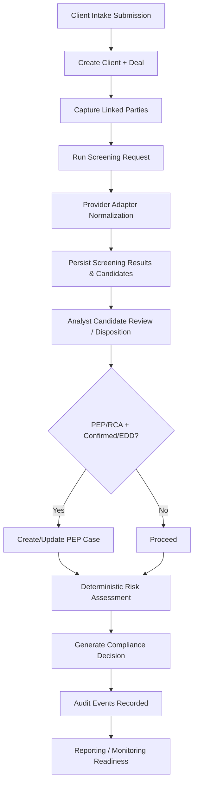
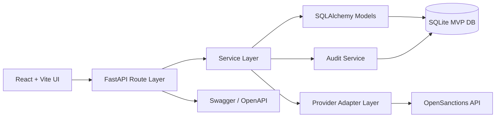
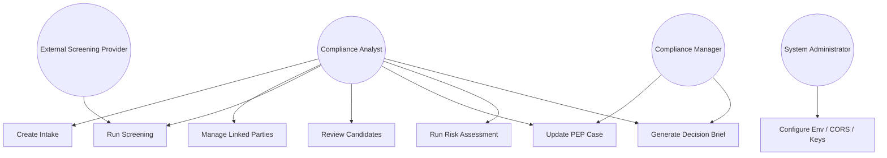
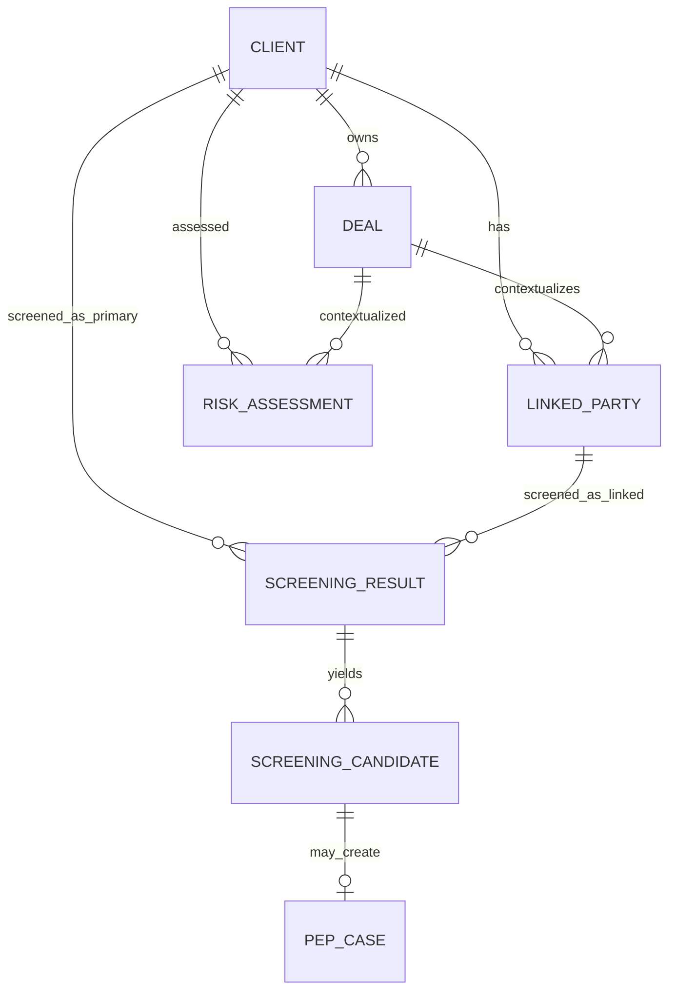
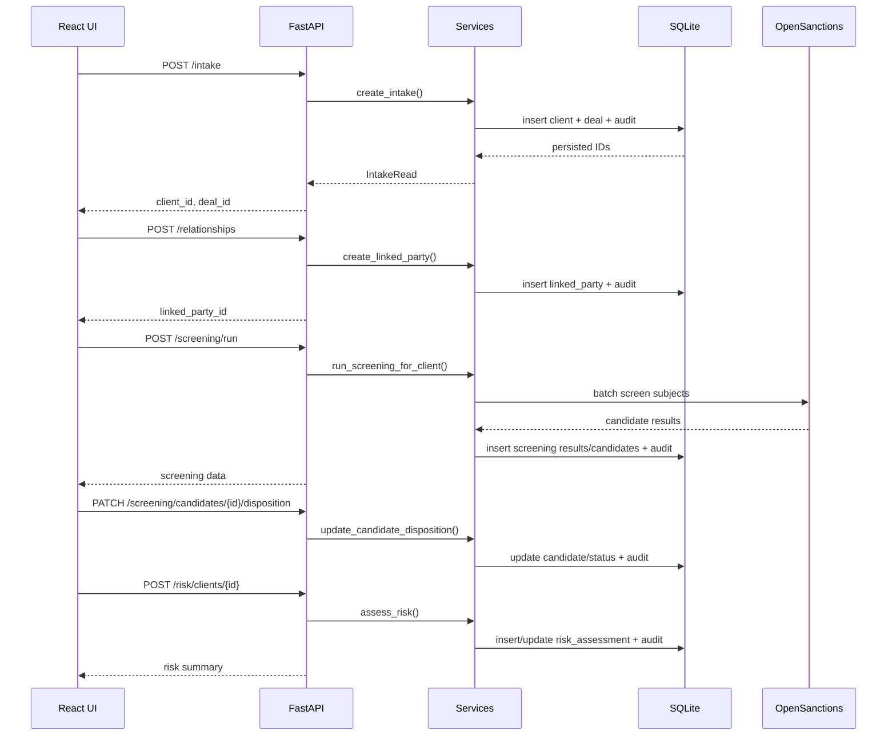

# TrustGate MVP Technical Prototype Document

**Project:** TrustGate MVP  
**Technology Stack:** FastAPI, SQLAlchemy, Pydantic, SQLite, React + Vite, Tailwind CSS, OpenSanctions Adapter  
**Document Purpose:** Technical prototype documentation grounded in repository implementation evidence.

---

## CHAPTER 1: INTRODUCTION

### 1.1 Summary of Results, Conclusions and Recommendations from Research

The TrustGate MVP is positioned in a compliance-operational context where institutions handling high-value, relationship-rich transactions must reconcile multiple evidence streams into defensible, auditable decisions. The repository demonstrates a prototype deliberately centered on real-estate-aligned due diligence workflows rather than a generic workflow engine. That focus is visible in data fields such as property location, transaction value, transaction type, cross-border indicator, source-of-funds summary, linked-party role taxonomy, and deterministic risk-factor triggers that specifically combine screening outcomes with transaction context. In practical terms, the implemented system is less a “forms app” and more an orchestration baseline for Customer Due Diligence (CDD), sanctions/PEP screening, review controls, and explainable decision support.

Research in compliance transformation consistently highlights fragmentation as the dominant practical failure mode: onboarding data in one place, relationship data in another, screenings run manually or in disconnected tools, risk judgment made in spreadsheets, and audit evidence reassembled after-the-fact. TrustGate’s architecture and service layer directly address that gap by converging intake, linked-party mapping, provider-mediated screening, dispositioning, PEP/RCA case controls, deterministic risk scoring, and a generated compliance decision into one backend domain. The prototype therefore operationalizes a key research conclusion: effective compliance is not only about identifying risky entities; it is about preserving a traceable, context-rich chain from data capture to final control action.

A core research conclusion encoded in this MVP is that compliance systems should separate concerns cleanly so that policy and workflow can evolve without destabilizing infrastructure. The repository reflects this via route modules (HTTP boundary), schemas (Pydantic contract layer), model layer (SQLAlchemy persistence), services (domain logic), and provider adapter abstraction (external API integration boundary). This modularity is crucial for a regulated domain because policies and thresholds are expected to change over time while auditability and continuity requirements remain. The prototype’s structure shows this philosophy explicitly: policy logic for candidate categorization is implemented in screening service methods and serialized in `policy_flags`, while risk thresholds are encapsulated in rule constants inside the risk service.

Another major research-driven design recommendation represented in the implementation is deterministic explainability. Rather than returning opaque screening outcomes, the prototype stores policy metadata, weighted signals, thresholds, and alert rationales for each screening candidate. The system also includes a view-oriented migration script documenting expected JSON structure and analyst-friendly flattening semantics. This contributes directly to explainable controls: reviewers can not only see that a candidate was categorized as PEP/RCA/standard, but also inspect why that category was assigned and which false-positive reduction rules applied.

The research case for relationship-centric due diligence is also strongly reflected. TrustGate does not treat “client” as the only screened subject. The screening workflow composes a batch including the primary client and screenable linked parties, then persists separate screening result records by subject type. That design supports a real-world conclusion: adverse exposure often appears through related individuals or entities (beneficial owners, representatives, intermediaries) rather than only the transacting primary party. The risk engine then consumes both primary and linked-party confirmed-match counts, preserving the analytic distinction between direct and indirect exposure.

The prototype’s recommendations embedded in code can be summarized as follows:

1. **Digitized intake as a foundational control:** client + deal capture are created atomically and audited.
2. **Relationship mapping as first-class compliance data:** linked parties have role semantics and screening flags.
3. **Integrated sanctions/PEP/RCA screening:** provider adapter calls are centralized and normalized.
4. **Deterministic risk scoring:** explicit rule weights and thresholds generate reproducible risk levels.
5. **Auditability by design:** important lifecycle events emit structured audit records.
6. **EDD support through case management primitives:** PEP/RCA candidates can trigger dedicated case records with verification statuses.
7. **Extensibility through abstraction layers:** adapter and service boundaries support future providers/rules.

From a prototype-evaluation perspective, one of the most significant conclusions is that the implemented MVP already demonstrates end-to-end continuity: intake can be created, linked parties added, screening run, candidate dispositions updated, PEP cases opened and managed, risk assessed, and an aggregated compliance decision generated. This matters because many prototypes stop at either UI mockup or isolated API endpoints. Here, a coherent flow exists and is consumable by the React frontend.

At the same time, the repository truth indicates deliberate prototype constraints. Authentication/authorization is not yet a full production control boundary; actor context is currently defaulted to `demo_user` in service calls unless explicitly passed. SQLite is suitable for rapid MVP operation but not the target for high-concurrency production. The frontend includes bearer token plumbing but backend enforcement layers are not represented as complete IAM controls. These realities should not be interpreted as design flaws; they should be read as staged implementation decisions consistent with evolutionary prototyping.

The implemented architecture also supports the research recommendation that screening integration should be provider-agnostic at the domain boundary. The OpenSanctions adapter normalizes remote response structures into internal candidate/result models, enabling downstream services (classification, risk, decisions) to consume stable types irrespective of provider payload idiosyncrasies. This pattern materially reduces coupling and supports future substitutions or multi-provider strategies.

Critically, the prototype internalizes that compliance decisions require not only pass/fail logic but reasoned evidence packaging. The compliance decision service aggregates screening result IDs, candidate IDs, PEP case IDs, and risk assessment ID into explicit evidence output while providing top reasons and required actions. This supports a recommendation from regulatory operations research: decisions should be reviewable as structured artifacts, not solely as endpoint side effects.

The model-level design further reflects research conclusions around regulatory defensibility: timestamped records, status enums, and captured request/response payload snapshots maintain a forensic chain. Screening failures are persisted as failed screening results with error context and corresponding audit logs, preserving negative evidence and operational transparency.

Finally, the implemented MVP directly reflects a practical recommendation for adoption: include a usable workflow UI early. The React interface is intentionally operational rather than presentation-only. It guides users through intake, relationship creation, screening, candidate review, PEP case visibility, risk assessment, and decision brief generation. This supports faster validation with compliance analysts and enables iterative refinement of rules, labels, and process controls.

In conclusion, the repository-backed result is a functioning compliance prototype that transforms research recommendations into concrete executable pathways. It does not claim production completeness; instead, it intentionally prioritizes evidence continuity, deterministic logic, extensibility seams, and workflow visibility—exactly the characteristics needed to validate an MVP in a high-scrutiny compliance domain.

### 1.2 Statement of the Problem for the Prototype

The operational problem addressed by TrustGate is the inability of fragmented compliance processes to deliver consistent, timely, and auditable decisions in relationship-heavy transactions. In many organizations, primary client onboarding, transaction capture, related-party identification, sanctions screening, PEP evaluation, and risk scoring are spread across disconnected systems or manual handoffs. This produces delays, inconsistent analyst judgment, weak reproducibility, and poor audit readiness.

For real-estate-aligned due diligence, the problem is amplified by transaction characteristics: high value, jurisdictional complexity, layered ownership, and involvement of multiple representatives or counterparties. A simplistic single-entity check is insufficient. Compliance teams need a mechanism that can connect client, deal, linked parties, screening evidence, and risk controls into one traceable chain.

The technical problem can be framed as follows:

- How can intake, relationship mapping, and screening be orchestrated into one coherent service architecture?
- How can external provider results be normalized into stable internal records?
- How can candidate-level analyst actions feed deterministic risk calculations?
- How can final decision outputs include explicit evidence and required actions?
- How can this be done in an MVP architecture that supports iterative policy refinement?

Manual and fragmented workflows fail in several ways:

1. **Data duplication and drift:** client identifiers, names, and context diverge across spreadsheets and portals.
2. **Weak relationship visibility:** beneficial owners and intermediaries are captured inconsistently.
3. **Opaque screening handling:** results are not systematically tied to intake context.
4. **Non-reproducible risk judgments:** analysts produce narrative decisions without deterministic scoring evidence.
5. **Poor audit trail continuity:** reconstruction of who did what and when is expensive and error-prone.

TrustGate’s scope addresses these pain points with specific MVP boundaries:

- It provides **structured client intake** and **deal capture**.
- It supports **linked-party CRUD** with role and screening-required semantics.
- It executes **screening for primary client and linked parties** using provider abstraction.
- It persists **screening outcomes and candidate details**, including policy metadata.
- It supports **candidate disposition updates** and **PEP/RCA case lifecycle primitives**.
- It computes **deterministic risk assessments** from rule-based factors.
- It emits a **compliance decision artifact** with evidence and required actions.
- It stores **audit events** for major lifecycle operations.

Scope boundaries (explicitly not fully implemented for production at MVP stage) include:

- Complete authentication and role-based authorization control matrix.
- Full workflow engine for multi-stage approvals and SLA escalation.
- Continuous watchlist monitoring scheduler and event-driven re-screening automation.
- Production-grade secrets management, centralized SIEM integration, and hardened deployment templates.
- Advanced reporting dashboards and historical trend analytics.

The prototype thus addresses the critical “operational spine” problem: establishing a single source of workflow truth from intake to decision with enough determinism and evidence depth to support analyst work and future hardening.

### 1.3 System Objectives

The TrustGate MVP objectives are mapped to implemented capabilities and clearly marked future extensions where appropriate.

#### 1.3.1 Client intake objective
Provide a structured mechanism to register client profile and status metadata as the initial compliance record. The system objective includes validating required fields, capturing identity context, and preserving timestamps for lifecycle tracking.

#### 1.3.2 Deal/transaction capture objective
Capture transaction-level context aligned to real-estate due diligence, including transaction reference uniqueness, transaction type, property location, transaction value, currency, cross-border flag, and source-of-funds summary. This objective ensures risk logic can incorporate deal context.

#### 1.3.3 Linked-party and relationship mapping objective
Enable analysts to register linked parties with explicit role types and relationship-to-client descriptors. This objective supports beneficial ownership and associated-party visibility and is essential for downstream screening and risk computations.

#### 1.3.4 PEP and sanctions screening objective
Execute screening operations against both primary and linked entities, normalize provider output, and persist candidate-level evidence. Include subject snapshots and request/response traces to support reproducibility.

#### 1.3.5 Provider-adapter abstraction objective
Isolate external API integration behind an adapter layer so internal screening logic is provider-independent. This objective supports maintainability, resilience to provider payload changes, and future provider pluralism.

#### 1.3.6 Deterministic risk scoring objective
Apply transparent rule-based scoring using objective factors such as confirmed matches, transaction size, cross-border indicators, and beneficial ownership completeness. Persist factor breakdown and narrative summary to support explainability.

#### 1.3.7 Enhanced due diligence workflow support objective
Provide case-level controls for PEP/RCA outcomes including status lifecycle, senior approval state, source-of-wealth/source-of-funds verification fields, monitoring flags, and closure evidence placeholders.

#### 1.3.8 Ongoing monitoring readiness objective
Even though continuous monitoring automation is a planned extension, the objective is to structure data and statuses so periodic or event-driven re-screening can be layered later without model redesign.

#### 1.3.9 Auditability objective
Ensure all major control actions generate auditable events with actor, action, entity type/id, and metadata payload. This objective targets post-hoc explainability and control testing support.

#### 1.3.10 Reporting readiness objective
Provide enough structured data outputs (risk breakdown JSON, policy flags JSON, compliance decision evidence fields) to support future dashboarding and reporting without re-engineering core persistence.

#### 1.3.11 Future scalability objective
Use modular backend architecture and typed frontend API contracts so migration from SQLite to a production RDBMS, addition of background workers, stronger authn/authz, and richer analytics can proceed incrementally.

### 1.4 Chapter Summary

Chapter 1 established TrustGate’s purpose as a compliance prototype grounded in real repository implementation. The core problem is fragmentation across intake, relationship mapping, screening, risk judgment, and audit evidence. The MVP responds with an integrated architecture and deterministic workflow spine. Objectives were defined across intake, transaction context, linked-party handling, screening abstraction, risk explainability, EDD support, and audit/reporting readiness. Importantly, the chapter distinguishes implemented controls from planned production extensions, preserving technical honesty while demonstrating that the current prototype is already suitable for operational validation and iterative evolution.

---

## CHAPTER 2: PROCESS MODELLING

### 2.1 Introduction

Process modelling in TrustGate is not merely documentation; it is the control logic blueprint that determines how compliance evidence is captured, transformed, and acted upon. In regulated workflows, weak process definitions create inconsistent decisions even if software components are individually sound. Therefore, a model is needed that balances policy evolution with operational continuity.

TrustGate’s repository indicates a process-centric architecture: route modules expose stage-specific operations; services encode domain transitions; models represent process state at persistence level; and frontend steps mirror operational sequencing. This alignment makes the process model explicit and executable.

### 2.2 Process Model

#### 2.2.1 Waterfall suitability discussion
A strict waterfall model would require stable and fully specified requirements before implementation. In compliance MVP contexts, this is usually unrealistic because analyst feedback on usability, policy explainability, and disposition semantics emerges only after interacting with real flows. Waterfall can still contribute by enforcing formal documentation, but alone it is too rigid for TrustGate’s discovery phase.

#### 2.2.2 Throwaway prototyping suitability discussion
Throwaway prototyping is useful for UX experiments, but it underperforms where data integrity, evidence persistence, and audit semantics are central. TrustGate required durable models, migration scripts, and service logic that should survive iteration. Therefore a pure throwaway approach is unsuitable.

#### 2.2.3 Incremental model suitability discussion
Incremental delivery is highly relevant because TrustGate spans multiple modules that can be layered: intake, relationships, screening, risk, decisioning, and case management. Incremental implementation allows each slice to be validated while preserving working software.

#### 2.2.4 Evolutionary model suitability discussion
Evolutionary development is especially appropriate for compliance rules. Candidate classification thresholds, false-positive heuristics, and required-action semantics often need calibration after pilot usage. TrustGate’s use of policy packs and structured `policy_flags` aligns naturally with evolutionary adjustments.

#### 2.2.5 Selected approach: evolutionary incremental prototype
The most suitable process model is an **evolutionary incremental prototype model**. This combines staged capability growth with feedback-driven refinement. Repository evidence supports this selection:

- migrations introduce policy and PEP-case enhancements iteratively;
- screening logic includes versioned policy flags and adjustable weights;
- risk engine rules are centralized and deterministic for controlled tuning;
- frontend presents a complete path but remains lightweight for rapid iteration.

This model is ideal for compliance MVPs because organizations must validate both functionality and governance acceptability. TrustGate’s current scope demonstrates a coherent incremental baseline while preserving flexibility for policy evolution.

### 2.3 Feasibility Study

#### 2.3.1 Economic Feasibility

TrustGate MVP demonstrates favorable economic feasibility due to strategic stack choices:

- **FastAPI** reduces boilerplate and accelerates API development while providing automatic docs.
- **React + Vite** provides rapid UI iteration and low setup overhead.
- **SQLite** minimizes infrastructure cost during MVP validation.
- **SQLAlchemy + Pydantic** lower schema drift risk and improve maintainability.
- **OpenSanctions integration** avoids building a proprietary sanctions corpus for MVP.

From operations perspective, economic benefit appears in reduced manual rework:

1. single capture of intake data reused across steps;
2. linked parties handled in structured tables rather than ad hoc notes;
3. screening results persisted and reviewable instead of ephemeral API output;
4. deterministic risk scoring reduces ad hoc spreadsheet effort;
5. audit logs reduce retrospective reconstruction labor.

Cost risks remain:

- provider API usage costs may scale with screening volume;
- production hardening (authz, monitoring, infra) introduces future investment;
- migration from SQLite to production DB requires planned engineering effort.

Nevertheless, for MVP stage, the implemented architecture is economically rational and supports staged scaling.

#### 2.3.2 Technical Feasibility

**Backend feasibility:** Strong. FastAPI routes map cleanly to service methods; dependency injection for DB sessions is straightforward. SQLAlchemy models cover essential entities and relationships. Error handling converts domain exceptions into HTTP status semantics.

**Frontend feasibility:** Strong for MVP. React single-page workflow consumes backend endpoints with typed request/response definitions. UX emphasizes operational sequence and state feedback.

**API integration feasibility:** Demonstrated. OpenSanctions adapter handles request construction, timeout and HTTP errors, JSON validation, and normalization into internal candidate models.

**Database feasibility:** Suitable for prototype. SQLite with SQLAlchemy offers quick setup and transactional consistency for low-concurrency MVP. Schema includes indexes on key identifiers and statuses.

**Deployment feasibility:** Moderate. The app can run locally with minimal dependencies, but production deployment patterns (reverse proxy, secret vaulting, worker model, high availability) are planned extensions.

**Maintainability feasibility:** High due to modular decomposition. Services isolate domain logic, easing future modifications. Enums and schema contracts support consistency.

Technical constraints honestly observed:

- synchronous DB sessions in a primarily async-capable stack may need tuning for heavy scale;
- lifecycle table creation in startup is convenient for MVP but should transition to managed migrations in production;
- absence of robust auth middleware limits production readiness.

#### 2.3.3 Social Feasibility

Compliance systems fail socially when they impose opaque logic, duplicate effort, or misalign with analyst mental models. TrustGate improves social feasibility by:

- mirroring real analyst workflow order in the UI;
- exposing candidate-level details and policy alerts;
- enabling explicit disposition and reason capture;
- providing visible PEP case states and verification obligations;
- generating a decision brief with top reasons and evidence IDs.

These features support analyst trust and managerial review. The deterministic structure also helps onboarding new analysts because decision logic is inspectable rather than tacit.

Remaining social adoption considerations:

- user training on disposition semantics and case status transitions;
- governance alignment on thresholds and risk-factor weights;
- role delineation once multi-user auth is introduced.

#### 2.3.4 Operational Feasibility

Operationally, the prototype can fit a compliance process as follows:

1. **Intake:** capture client + deal.
2. **Relationship enrichment:** add beneficial owners and other linked parties.
3. **Screening run:** submit primary + linked subjects through adapter.
4. **Review:** inspect candidates and set dispositions.
5. **PEP/RCA handling:** open/update cases for EDD obligations.
6. **Risk scoring:** compute deterministic score and level.
7. **Decision generation:** produce verdict, reasons, actions, and evidence package.
8. **Audit trail:** persist actions for control assurance.

Prototype-stage operational constraints:

- role-based segregation of duties is not fully enforced;
- continuous monitoring automation is not yet scheduled;
- operational analytics dashboarding remains limited;
- external provider availability directly impacts screening execution.

Even with these constraints, the MVP is operationally feasible for pilot and process validation.

### 2.4 System Security

Security posture should be assessed in two categories: implemented controls and recommended production controls.

#### 2.4.1 Implemented security-relevant controls

- **Environment-based configuration:** settings class reads DB URL, CORS policy, OpenSanctions key, and threshold values from environment.
- **Secret handling:** OpenSanctions API key is typed as `SecretStr` and consumed by adapter.
- **CORS policy configuration:** explicit origin list and credential flag control browser access scope.
- **Input validation:** Pydantic schemas enforce constraints and enum boundaries.
- **Route separation and service boundaries:** reduces accidental exposure of internal operations.
- **Audit logging:** captures actor/action/entity/metadata for critical events.
- **Provider abstraction:** centralizes external call handling and validation.

#### 2.4.2 Prototype constraints and implications

- Authentication/authorization is not fully implemented as a production-grade control plane.
- Actor values default to demo context in services, suitable for MVP but insufficient for accountability in multi-user production.
- SQLite backend is not encrypted or hardened by default in this repository.
- Startup-time table creation bypasses stricter migration governance expected in regulated production systems.

These are acceptable prototype compromises but must be addressed before operational deployment.

#### 2.4.3 Recommended production controls

1. Add robust authentication (OIDC/JWT) and RBAC/ABAC authorization.
2. Enforce role-segregated actions (analyst vs manager vs admin).
3. Integrate centralized secret management and key rotation.
4. Use PostgreSQL (or equivalent) with backups, encryption, and migration discipline.
5. Add structured security logging and SIEM forwarding.
6. Add idempotency, rate limiting, and stronger API abuse protection.
7. Add background job orchestration for monitoring and re-screening.

### 2.5 Chapter Summary

Chapter 2 justified an evolutionary incremental process model as most suitable for a compliance MVP where policy and workflow semantics require iterative validation. Economic and technical feasibility are strong at prototype scale due to a low-friction stack and modular architecture. Social and operational feasibility are supported by workflow alignment and explainable controls. Security posture is credible for MVP but intentionally incomplete for production; key controls are identified as planned extensions. The chapter therefore confirms that TrustGate is process-feasible as a pilot-ready prototype with a clear hardening roadmap.

---

## CHAPTER 3: SOFTWARE METHODOLOGY

### 3.1 Introduction

TrustGate’s software methodology translates a compliance research problem into executable components across backend, frontend, persistence, and external provider integration. The methodology emphasizes:

- explicit domain models;
- predictable API contracts;
- deterministic policy logic;
- auditable state transitions;
- modular extensibility.

Rather than implementing monolithic route handlers, the repository organizes business logic in services and keeps routes focused on transport concerns. This supports maintainability and policy evolution. The frontend, in turn, is implemented as a workflow shell that exposes essential controls and evidence without introducing hidden business logic.

### 3.2 Process Flow Chart

The implemented end-to-end process flow is shown below.



**Figure 3.1: TrustGate MVP end-to-end process flow.**

Narratively, the process starts with intake and transaction capture, then expands entity scope via linked parties. Screening executes in batch through provider adapter mediation, after which candidate-level records can be dispositioned. PEP/RCA cases are opened where appropriate. Deterministic risk assessment synthesizes transaction and screening context. A final compliance decision compiles evidence and required actions. Audit events surround each stage to ensure traceability.

### 3.3 System Description and Architecture

TrustGate uses a layered architecture.



**Figure 3.2: TrustGate MVP architecture.**

#### 3.3.1 FastAPI backend
FastAPI is suitable here due to typed path operations, dependency injection for DB sessions, clear status handling, and generated OpenAPI docs. The app startup includes router registration for intake, relationships, screening, risk, and compliance decisions.

#### 3.3.2 React + Vite frontend
React + Vite is suitable for rapid workflow prototyping and iterative analyst feedback. The UI is intentionally process-driven, showing IDs and state transitions to maintain operational continuity across steps.

#### 3.3.3 SQLAlchemy ORM and SQLite
SQLAlchemy models define entities and enums for consistency. SQLite provides low-overhead persistence for MVP; migration files indicate evolutionary schema management for added PEP/policy features.

#### 3.3.4 Pydantic schemas and route modules
Schemas enforce request/response validation at API boundaries. Route modules keep HTTP concerns separate from domain logic, improving readability and maintainability.

#### 3.3.5 Service layer
Services implement intake orchestration, relationship validation, screening workflows, risk scoring, and compliance decision synthesis. This is the methodological core where business logic resides.

#### 3.3.6 Provider adapter layer
The OpenSanctions adapter encapsulates API interaction, request construction, error handling, and normalization. Downstream services thus operate on internal models rather than raw provider payloads.

#### 3.3.7 Audit logging and CORS configuration
Audit service persists structured events for key actions. CORS settings are environment-driven to support local UI development while enabling production tightening.

#### 3.3.8 Scalability pathway
Scaling can proceed by replacing SQLite with PostgreSQL, adding auth and role controls, introducing async/background execution for recurring screening, and expanding provider abstraction.

### 3.4 Use Case, UML and Sequence Diagram

#### 3.4.1 Use Case Analysis

Actors:

- **Compliance Analyst**: performs intake, relationship capture, screening review, case updates.
- **Compliance Manager**: reviews outcomes, verifies EDD obligations, approves escalated cases.
- **External Screening Provider**: supplies candidate matches.
- **System Administrator**: configures environment, policies, and deployment controls.



**Figure 3.3: TrustGate use-case-oriented diagram.**

#### 3.4.2 Entity/Data Model Description

Major entities include:

- `Client`
- `Deal`
- `LinkedParty`
- `ScreeningResult`
- `ScreeningCandidate`
- `PepCase`
- `RiskAssessment`
- `AuditLog`



**Figure 3.4: TrustGate conceptual ERD.**

#### 3.4.3 Sequence Diagram



**Figure 3.5: TrustGate sequence diagram for core workflow.**

#### 3.4.4 Code-Level Methodology

Below are representative snippets from implemented files.

**Snippet 1 — FastAPI startup and router inclusion**  
*File:* `app/main.py`

```python
app = FastAPI(..., lifespan=lifespan)
app.add_middleware(CORSMiddleware, allow_origins=settings.CORS_ALLOW_ORIGINS,
                   allow_credentials=settings.CORS_ALLOW_CREDENTIALS,
                   allow_methods=["*"], allow_headers=["*"])
app.include_router(intake_router)
app.include_router(relationships_router)
app.include_router(screening_router)
app.include_router(risk_router)
app.include_router(compliance_router)
```

This establishes application composition and module boundaries.

**Snippet 2 — CORS/configuration**  
*File:* `app/core/config.py`

```python
CORS_ALLOW_ORIGINS: list[str] = Field(default_factory=lambda: ["http://localhost:5173"])
CORS_ALLOW_CREDENTIALS: bool = Field(default=False)
```

These settings support environment-driven browser API access policy.

**Snippet 3 — Database/session setup**  
*File:* `app/core/database.py`

```python
engine = create_engine(settings.DATABASE_URL, connect_args=connect_args, pool_pre_ping=True)
SessionLocal = sessionmaker(bind=engine, autocommit=False, autoflush=False, class_=Session)
```

This centralizes persistence connectivity and session lifecycle.

**Snippet 4 — Intake service orchestration**  
*File:* `app/services/intake_service.py`

```python
client = Client(**payload.client.model_dump())
db.add(client); db.flush()
deal = Deal(client_id=client.id, **payload.deal.model_dump())
db.add(deal); db.flush()
record_audit_event(... action="client.created" ...)
record_audit_event(... action="deal.created" ...)
db.commit()
```

This shows atomic intake + deal creation with immediate audit events.

**Snippet 5 — Relationship mapping validation**  
*File:* `app/services/relationship_service.py`

```python
RelationshipService._validate_client_and_deal(db=db, client_id=payload.client_id, deal_id=payload.deal_id)
linked_party = LinkedParty(**payload.model_dump())
```

Validation ensures relationship integrity between client and deal context.

**Snippet 6 — Screening/provider adapter interaction**  
*File:* `app/services/screening_service.py`

```python
provider_response = await provider.screen_subjects(
    subjects=[subject.provider_input for subject in subjects],
)
```

*File:* `app/services/provider_adapter_service.py`

```python
url = f"{self.base_url}/match/{dataset}"
response = await client.post(url, params=params, json=payload, headers=headers)
```

These lines capture provider abstraction and controlled external I/O.

**Snippet 7 — Deterministic risk assessment logic**  
*File:* `app/services/risk_service.py`

```python
if confirmed_primary_client_match_triggered:
    total_score += cls.RULES.confirmed_primary_client_match_score
if high_value_transaction_triggered:
    total_score += cls.RULES.high_value_transaction_score
risk_level = cls._determine_risk_level(total_score)
```

Risk output is reproducible and threshold-based.

**Snippet 8 — Audit logging helper**  
*File:* `app/services/audit_service.py`

```python
audit_log = AuditLog(actor=actor, action=action, entity_type=entity_type,
                     entity_id=str(entity_id), metadata_payload=metadata_payload)
db.add(audit_log)
```

This supports cross-module traceability.

**Snippet 9 — Frontend API workflow binding**  
*File:* `ui/src/api/client.ts`

```typescript
runScreening: (clientId: number) => request<ScreeningResult[]>('/screening/run', {
  method: 'POST',
  body: JSON.stringify({ subject_type: 'client', client_id: clientId })
}),
```

Frontend explicitly maps user actions to backend workflow endpoints.

### 3.5 Chapter Summary

Chapter 3 described the implemented software methodology as a layered, service-driven architecture that operationalizes compliance workflow logic end to end. Process, architecture, and sequence diagrams demonstrated flow continuity from intake to decisioning. Code-level analysis showed separation of concerns, deterministic policy logic, and provider abstraction. The implementation is methodologically coherent for MVP validation and intentionally structured for incremental expansion.

---

## APPENDIX: COMPUTER CODE OF PROTOTYPE

### A.1 Backend startup and composition

**File:** `app/main.py`

```python
@asynccontextmanager
async def lifespan(app: FastAPI):
    Base.metadata.create_all(bind=engine)
    yield

app = FastAPI(title="TrustGate MVP", lifespan=lifespan)
...
app.include_router(intake_router)
app.include_router(relationships_router)
app.include_router(screening_router)
app.include_router(risk_router)
app.include_router(compliance_router)
```

**Note:** MVP startup auto-creates tables and composes modular routers.

### A.2 Environment and secrets configuration

**File:** `app/core/config.py`

```python
OPENSANCTIONS_API_KEY: SecretStr = Field(...)
OPENSANCTIONS_BASE_URL: str = Field(default="https://api.opensanctions.org")
SCREENING_MIN_SCORE: float = Field(default=0.70, ge=0.0, le=1.0)
```

**Note:** Configuration centralizes provider and threshold settings.

### A.3 Intake route and schema contracts

**File:** `app/api/routes/intake.py`

```python
@router.post("", response_model=IntakeRead, status_code=status.HTTP_201_CREATED)
def create_intake_case(payload: IntakeCreate, db: DBSession) -> IntakeRead:
    client, deal = create_intake(db=db, payload=payload)
    return _build_intake_response(client=client, deal=deal)
```

**Note:** Route stays thin; business logic lives in service layer.

### A.4 Linked-party service logic

**File:** `app/services/relationship_service.py`

```python
record_audit_event(... action="linked_party.created" ...)
```

**Note:** Relationship mutations are audited for traceability.

### A.5 Screening candidate classification policy

**File:** `app/services/screening_service.py`

```python
weighted_score = (
    provider_score_signal * policy_pack.provider_score_weight
    + list_quality_signal * policy_pack.list_quality_weight
    + concordance_signal * policy_pack.concordance_weight
)
```

**Note:** Candidate categorization uses deterministic multi-factor weighting.

### A.6 Provider adapter normalization

**File:** `app/services/provider_adapter_service.py`

```python
return ProviderScreeningCandidate(
    provider_candidate_id=provider_entity_id,
    provider_entity_id=provider_entity_id,
    matched_name=matched_name,
    match_score=match_score,
    dataset=dataset,
    country=country,
    notes=self._build_notes(candidate),
    candidate_payload=candidate,
)
```

**Note:** Raw provider payloads are normalized into stable internal structure.

### A.7 Risk scoring rules and persistence

**File:** `app/services/risk_service.py`

```python
class RiskScoringRules:
    confirmed_primary_client_match_score: Decimal = Decimal("50.00")
    confirmed_linked_party_match_score: Decimal = Decimal("25.00")
    high_value_transaction_score: Decimal = Decimal("15.00")
    cross_border_transaction_score: Decimal = Decimal("10.00")
    unknown_beneficial_ownership_score: Decimal = Decimal("20.00")
```

**Note:** Rules are explicit, enabling explainable and reproducible outputs.

### A.8 Compliance decision synthesis

**File:** `app/services/compliance_decision_service.py`

```python
if has_edd_candidate or has_open_pep_obligations or risk_assessment.risk_level == RiskLevel.HIGH:
    return ComplianceVerdict.EDD_REQUIRED
```

**Note:** Final verdict integrates screening and risk context into a single artifact.

### A.9 Frontend workflow controls

**File:** `ui/src/App.tsx`

```tsx
<button className={buttonClass} onClick={handleRunScreening}>Run Screening</button>
<button className={buttonClass} onClick={handleRunRisk}>Run Risk Assessment</button>
<button className={buttonClass} onClick={handleGenerateComplianceDecision}>Generate Compliance Decision</button>
```

**Note:** UI supports sequential analyst operations aligned to backend process.

### A.10 Frontend API client mapping

**File:** `ui/src/api/client.ts`

```typescript
generateComplianceDecision: (clientId: number, dealId?: number) =>
  request<ComplianceDecisionResponse>(`/compliance/clients/${clientId}/decision${dealId ? `?deal_id=${dealId}` : ''}`, {
    method: 'POST'
  })
```

**Note:** Typed API layer preserves contract clarity between frontend and backend.

---

## Concluding Remarks

TrustGate MVP demonstrates a technically coherent compliance workflow prototype grounded in implemented repository features. It prioritizes evidence continuity, deterministic scoring, explainability metadata, and modular extensibility. The current state is fit for pilot validation and policy calibration, while explicit production hardening steps remain as planned extensions.

### 3.4.5 Extended Methodological Analysis (Repository-Aligned)

To ensure this prototype document is materially useful for implementation, governance review, and further development, this section expands on practical methodology decisions evidenced in the codebase.

#### 3.4.5.1 Why service orchestration is central in this MVP

The repository demonstrates that TrustGate treats services as the normative location for compliance behavior. This is an important architectural decision in compliance software because it allows policy logic and lifecycle semantics to be versioned and reviewed independently from transport and UI concerns. If route handlers were used as primary logic containers, the system would quickly become brittle as requirements evolve. Instead, the current structure allows route modules to remain predictable and mostly declarative while services handle transaction boundaries, domain validation, exception translation, and audit instrumentation.

From a governance perspective, this means policy review can focus on service classes where the real decision pathways live. For example, screening classification logic, risk threshold logic, and decision synthesis logic are all inspectable in dedicated files. This enables technical committees, compliance managers, and engineers to discuss one shared representation of behavior, reducing ambiguity between “what the policy says” and “what the code does.”

#### 3.4.5.2 Transaction boundaries and persistence consistency

Several service methods follow a repeatable pattern: mutate one or more entities, write audit records, commit once, and refresh entities before return. This pattern is visible across intake, relationships, screening persistence, PEP case handling, and risk assessments. The methodological value of this design is consistency: reviewers can reason about when state becomes durable and what evidence accompanies that durability.

In an MVP context, this is particularly significant. Many prototypes ignore transactional discipline, creating non-deterministic bugs when workflows grow. TrustGate’s pattern reduces partial-write risk and ensures that high-level operations produce coherent postconditions. For instance, intake creation pairs client and deal creation within one transactional scope and records associated audit events prior to commit.

#### 3.4.5.3 Error taxonomy as a methodology artifact

Each major service defines scoped exception types (validation, not found, persistence, execution), and route layers map these to appropriate HTTP responses. This separation is not cosmetic. In compliance systems, it is important to distinguish input problems from provider outages and from persistence conflicts. The error taxonomy supports accurate operational triage and user feedback.

A practical consequence is improved observability and supportability: a `ScreeningExecutionError` can drive provider health investigation, while a `ScreeningValidationError` points to data quality or workflow misuse. As the system matures, this taxonomy can be mapped to alert classes and SLO reporting.

#### 3.4.5.4 Deterministic policy metadata and explainability

A major methodology advancement in this repository is the structured policy metadata stored in `policy_flags`. Rather than reducing screening outcomes to a simple label, the implementation preserves weights, thresholds, signal values, false-positive reduction decisions, and generated alerts. This creates a traceable and machine-readable explanation layer.

This design has four benefits:

1. **Analyst transparency:** reviewers can inspect why category assignment occurred.
2. **Policy governance:** threshold changes can be assessed against explicit stored factors.
3. **Model evolution:** future heuristics can be compared against historic outputs.
4. **Reporting readiness:** policy dimensions can be surfaced without reverse engineering.

Because this metadata is serialized at candidate level, decisions can be audited retrospectively even if policy code later evolves.

#### 3.4.5.5 Relationship-aware screening methodology

The screening service constructs subject contexts for both primary client and linked parties, then executes a batch provider call. This is methodological progress over single-subject screening because it makes relationship breadth a first-class operational concern. In real investigations, linked-party signals are often decisive. The prototype architecture avoids a common anti-pattern where linked-party checks are optional side tasks without durable linkage to decision flow.

By preserving subject type and subject snapshots per result, the system supports later investigation of whether exposure emerged from primary or related entities. This distinction is valuable for both risk modeling and case prioritization.

#### 3.4.5.6 PEP/RCA case management semantics

The PEP case model introduces structured workflow states and verification fields. Methodologically, this represents an explicit control transition from “candidate detected” to “obligations tracked.” The system can therefore represent unfinished due diligence obligations, not only detection events.

The presence of `senior_approval_status`, `source_of_wealth_status`, and `source_of_funds_status` in persistence signals that TrustGate is architected to support compliance controls beyond watchlist matching. This aligns with practical EDD operations where evidence sufficiency and approvals are central.

#### 3.4.5.7 Risk methodology and rule transparency

Risk scoring rules are explicit decimal values with named thresholds. This transparent approach is important in early-stage compliance systems because it avoids hidden statistical models that are difficult to explain to regulators or internal audit teams. The system also persists factor breakdown and triggered-factor lists, creating a direct mapping between data conditions and risk outcomes.

This deterministic approach is not intended as a final model sophistication ceiling. Rather, it is a baseline that enables controlled calibration. Over time, additional factors can be introduced while retaining explainability by extending the factor structure and versioning strategy.

#### 3.4.5.8 Decision synthesis methodology

The compliance decision service demonstrates a synthesis pattern: execute screening/risk updates, infer verdict using explicit rules, package evidence references, and emit required actions. This creates a decision artifact suitable for review boards and downstream workflow tooling.

Methodologically, this is superior to returning only a verdict because it bundles rationale and actionability. A decision without required actions is operationally weak; TrustGate’s approach reduces that gap by generating tasks linked to PEP case verification states.

#### 3.4.5.9 Frontend methodology: operational continuity over visual complexity

The frontend is intentionally pragmatic. It prioritizes displaying key IDs, statuses, and actionable controls rather than polished but opaque views. This design supports analysts who need continuity across steps and clear evidence of system state. The “single-screen workflow spine” lowers context switching and encourages consistent operational execution.

As a methodology choice, this is appropriate for MVP validation where process correctness and usability feedback matter more than advanced UI theming.

#### 3.4.5.10 Architectural debt register (explicit)

A mature methodology includes identifying controlled debt. Current repository-backed debt items include:

- authentication and role enforcement not yet production-grade;
- SQLite persistence suitable for MVP but not final scale;
- startup table creation should migrate to stricter migration-only discipline;
- no asynchronous job queue for recurring monitoring tasks;
- limited built-in analytics/reporting layer.

By making debt explicit, the prototype remains credible and easier to transition to production.

### 3.4.6 Implementation Traceability Matrix

| Objective | Implemented Components | Current State | Notes |
|---|---|---|---|
| Client intake | intake routes + intake service + client/deal models | Implemented | Supports create/read/update with audit events |
| Deal context capture | deal fields in model/schema/service | Implemented | Includes value, location, type, cross-border flag |
| Linked-party mapping | relationship routes/service/model | Implemented | Role taxonomy and screening_required supported |
| Screening integration | screening service + provider adapter | Implemented | Batch screening for client + linked parties |
| Candidate review | disposition endpoint + service logic | Implemented | REVIEWED status and reviewed timestamp updates |
| PEP/RCA case controls | pep_cases model + endpoints + service | Implemented | Case creation and updates available |
| Deterministic risk | risk service + rules + factor breakdown | Implemented | Transparent scoring and thresholds |
| Auditability | audit service + audit_logs model | Implemented | Event records across workflow |
| Decision synthesis | compliance decision service/route | Implemented | Verdict + top reasons + evidence + actions |
| Monitoring automation | scheduler/background workflows | Planned extension | Data model partially ready |
| RBAC and auth enforcement | policy middleware/identity provider integration | Planned extension | Frontend token plumbing exists |

**Table 3.1: Objective-to-implementation traceability matrix.**

### 3.4.7 Data Governance and Quality Considerations

Even at MVP stage, data quality governance is foundational for compliance reliability. TrustGate currently supports baseline quality through schema constraints, enum usage, and service-level relationship validation. However, further governance layers are recommended.

#### 3.4.7.1 Current quality controls

- field-level constraints via Pydantic schemas;
- enum-restricted statuses and role values;
- referential integrity in model foreign keys;
- service checks for client-deal consistency;
- distinct handling of not-found versus validation errors.

#### 3.4.7.2 Recommended quality controls for next increment

1. standardized normalization for names, countries, and identifiers;
2. duplicate detection heuristics for linked-party entries;
3. stricter date validation and timezone normalization policies;
4. required evidence rules when setting certain dispositions;
5. periodic data-quality audit reports over null/optional critical fields.

### 3.4.8 Security Engineering Expansion (MVP-to-Production Path)

The prototype has foundational controls but should be hardened systematically.

#### 3.4.8.1 Identity and access

A production version should implement centralized identity provider integration, token verification middleware, route-level role guards, and service-level authorization checks for sensitive transitions (e.g., approving PEP cases). Actor attribution should be sourced from verified identities and propagated across audit events.

#### 3.4.8.2 Secrets and configuration

The existing environment-variable approach is appropriate for development, but production should use dedicated secret management and rotation. Configuration changes (e.g., threshold values) should be auditable and ideally versioned with approval workflows.

#### 3.4.8.3 Data protection

Data-at-rest encryption, database backup policy, retention rules, and secure deletion protocols should be formalized. Sensitive fields may require tokenization or encryption-at-column level depending on jurisdictional requirements.

#### 3.4.8.4 Observability and incident response

Structured logs should include trace IDs and correlation IDs linking API actions, provider calls, and database writes. Alerting should distinguish operational failures (provider timeout) from policy anomalies (spike in high-severity alerts).

### 3.4.9 Deployment and Scalability Methodology

The MVP currently supports local or simple hosted deployment. A production trajectory can proceed in staged increments:

1. Containerization and reproducible build pipeline.
2. Migration from SQLite to PostgreSQL.
3. Dedicated worker process for scheduled/rescreening jobs.
4. API gateway with rate limiting and WAF rules.
5. Blue/green or canary deployments for policy-sensitive changes.
6. Read-optimized analytics replica for reporting workloads.

A staged method reduces operational shock and allows control validation at each layer.

### 3.4.10 Operational Runbook Baseline

A minimal runbook for pilot operation should include:

- startup configuration checklist;
- provider API key verification procedure;
- intake/screening/risk troubleshooting guide;
- incident classification matrix;
- backup and restore verification steps;
- audit-log extraction procedure for internal review.

While not fully implemented as scripts in this repository, the current architecture supports such runbook formalization.

### 3.4.11 Reporting and Analytics Readiness

TrustGate’s persistence model enables future reporting in several dimensions:

- volume of screenings by period and subject type;
- candidate category distribution (standard/PEP/RCA);
- disposition outcomes and turnaround;
- PEP case status aging;
- risk score and level distributions;
- correlation between triggered factors and decision verdicts.

The migration-provided policy-audit view concept indicates awareness of analyst-facing query needs.

### 3.4.12 Reliability and Failure Semantics

The screening service explicitly persists failed screening results when provider calls fail. This is methodologically important: failure is captured as an auditable event, not silently dropped. Such persistence allows operations teams to track disruption impact and rescreen affected subjects later.

Similarly, use of specific exception classes and conflict handling supports predictable API behavior under persistence errors. These patterns contribute to reliability by making failure modes explicit and recoverable.

### 3.4.13 Compliance Control Mapping (Illustrative)

| Control Intent | MVP Mechanism | Limitation |
|---|---|---|
| Capture customer and transaction context | Intake models/routes/services | No advanced form templates yet |
| Identify related parties | Linked-party model and CRUD | Duplicate-detection heuristics limited |
| Perform sanctions/PEP screening | Provider adapter + screening service | Single provider implementation |
| Explain potential matches | policy_flags explainability metadata | Advanced analyst UI filters limited |
| Escalate PEP/RCA obligations | pep_cases workflow fields | No SLA/escalation engine |
| Quantify risk consistently | deterministic rules in risk service | Rule set intentionally simple |
| Preserve audit evidence | audit_logs across services | Actor identity currently demo default unless provided |

**Table 3.2: Illustrative mapping from control intent to MVP implementation.**

### 3.4.14 Methodology for Future Enhancements

Future enhancements should follow the same pattern used in current codebase:

1. define or extend schema/model contracts;
2. implement service logic with explicit exception taxonomy;
3. add route bindings with response-model guarantees;
4. emit audit events for lifecycle mutations;
5. expose minimal but usable frontend controls;
6. document migration and policy implications;
7. calibrate with analyst feedback and measure outcomes.

This method preserves consistency and governance continuity.

### 3.4.15 Extended Chapter Synthesis

In aggregate, repository evidence shows TrustGate as a structurally sound compliance MVP rather than a superficial demo. It already supports critical control continuity from intake through decisioning, while maintaining transparent policy data and audit trails. The methodology is especially strong in its disciplined service boundaries, deterministic reasoning artifacts, and relationship-centric screening model. These choices create a practical bridge from MVP validation to production hardening.

## ADDENDUM: EXTENDED CHAPTER 2 ANALYSIS (Repository-Constrained)

### A2.1 Economic Sensitivity Scenarios

To deepen feasibility analysis, this section outlines practical economic sensitivity scenarios based on MVP architecture.

#### Scenario 1: Low-volume pilot (tens of cases per week)

In this mode, the current stack is highly cost-efficient. SQLite is sufficient, infrastructure overhead remains minimal, and screening volume does not create meaningful external API cost pressure. The largest cost component is analyst time, and TrustGate improves this by reducing manual context-switching and evidence reconstruction.

#### Scenario 2: Medium-volume operations (hundreds of cases per week)

At medium volume, cost drivers shift. Screening calls become material, concurrency increases, and reporting demand grows. Even before full production hardening, value emerges through consistent dispositioning, reduced false escalations via explainable candidate classification, and faster generation of decision briefs. Incremental migration to PostgreSQL and lightweight worker queues would likely be justified economically at this stage.

#### Scenario 3: Multi-team adoption (cross-branch or multi-jurisdiction)

This scenario introduces governance complexity and higher operational risk if controls remain informal. The economic value of shared deterministic policies and centralized evidence grows sharply. However, investment in identity management, audit forwarding, and policy governance interfaces becomes mandatory. TrustGate’s modularity helps manage this transition without rewriting core workflow logic.

### A2.2 Technical Feasibility by Component Quality Attributes

| Component | Reliability | Maintainability | Extensibility | Performance (MVP) |
|---|---|---|---|---|
| FastAPI route layer | High | High | High | High |
| Service layer | High | High | High | Moderate-High |
| SQLAlchemy models | High | High | Moderate-High | High |
| SQLite persistence | Moderate | High | Moderate | Moderate |
| Provider adapter | Moderate-High | High | High | Moderate |
| React workflow UI | Moderate-High | Moderate-High | High | High |

**Table A2.1: Qualitative component feasibility assessment.**

### A2.3 Operational Constraint Register

| Constraint | Current Impact | Mitigation Path |
|---|---|---|
| No full RBAC enforcement | Limits production control assurance | Introduce auth middleware + route/service checks |
| SQLite single-node nature | Limits scale/concurrency | Migrate to PostgreSQL with migration governance |
| Manual monitoring cadence | Delayed re-screening potential | Add scheduler + event triggers |
| Basic UI analytics | Limited managerial visibility | Add dashboards from existing evidence models |
| Provider dependency | External outage risk | Add retry/backoff + optional secondary provider |

**Table A2.2: Prototype operational constraint register.**

### A2.4 Security Control Maturity View

A practical maturity model helps position current state:

- **Level 1 (Implemented MVP):** configuration externalization, input validation, CORS settings, audit event persistence, external-call error handling.
- **Level 2 (Near-term hardening):** authentication enforcement, role checks, structured application logging with trace context, managed migrations.
- **Level 3 (Production governance):** centralized secrets, SIEM integration, policy-change workflows, continuous controls monitoring, formal incident response automation.

This maturity framing avoids overstating current posture while providing a concrete roadmap.

### A2.5 Human Factors and Analyst Experience

Adoption success in compliance tooling depends on cognitive ergonomics as much as technical correctness. TrustGate’s workflow-first UI and explicit identifiers reduce ambiguity during case handling. Candidate-level policy alerts and disposition controls align with how analysts reason about uncertain matches.

Potential improvements for analyst experience include:

1. saved filters for candidate review queues;
2. case-aging indicators for PEP obligations;
3. reason-code templates for consistent disposition narratives;
4. inline comparison between candidate signals and thresholds;
5. manager-only summary panels for team-level workload balancing.

Because backend contracts are already structured, these enhancements can be added without major domain redesign.

### A2.6 Governance Implications of Deterministic Policies

Deterministic scoring and classification have governance advantages and caveats.

Advantages:

- reproducibility for audit and challenge processes;
- straightforward policy committee review;
- easier calibration with historical outcomes;
- clear communication to non-technical stakeholders.

Caveats:

- deterministic rules may underfit nuanced edge cases;
- threshold drift risk if calibration processes are weak;
- analyst over-reliance risk if narrative review discipline declines.

TrustGate mitigates some caveats by preserving rich evidence fields and supporting manual dispositions/case updates.

### A2.7 Summary of Extended Process and Feasibility Insights

The extended Chapter 2 analysis reinforces that TrustGate’s MVP stack is economically and technically sensible for pilot validation while remaining honest about production gaps. The architecture is strong enough to support incremental hardening, and the workflow alignment is likely to improve analyst consistency and audit readiness. The most important next-step investments are access control, database platform migration, observability enhancement, and monitoring automation.

## ADDENDUM: EXTENDED CHAPTER 1 CONTEXTUALIZATION

### A1.1 Why real-estate-aligned due diligence benefits from this prototype form

Real-estate transactions frequently combine high value, layered ownership, intermediated payments, and cross-border legal structures. These characteristics increase the probability that compliance-relevant exposure is distributed across multiple associated parties rather than concentrated in a single declared customer. TrustGate’s architecture directly addresses this by formalizing linked-party capture and screening integration as mandatory adjacent steps to intake.

### A1.2 Problem decomposition and prototype boundary discipline

A common failure in early compliance platforms is attempting full enterprise scope too early, resulting in brittle and unfinished systems. TrustGate uses boundary discipline: it solves end-to-end workflow continuity for a defined operational slice. This choice increases the chance of successful pilot validation and yields concrete evidence for prioritizing future increments.

### A1.3 Strategic value of audit-first design in MVP stage

Although audit trail design is often deferred in prototypes, TrustGate includes audit recording as a cross-cutting concern. This strategic choice supports credible demonstrations with compliance stakeholders, who generally evaluate systems not only by features but by ability to explain and evidence actions.

### A1.4 Introductory chapter reinforcement

The introduction’s core thesis remains: TrustGate is not a generic CRUD application; it is a compliance workflow prototype with deterministic decision support and auditable evidence continuity. Repository implementation substantiates this thesis across backend services, models, frontend controls, and migration-level policy documentation.
